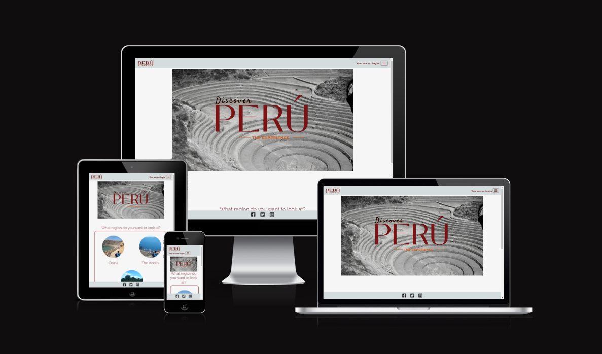
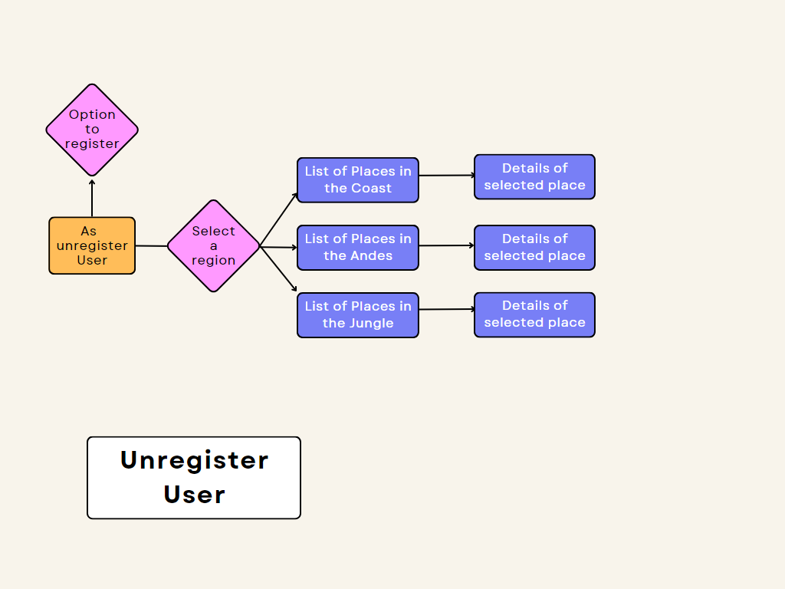
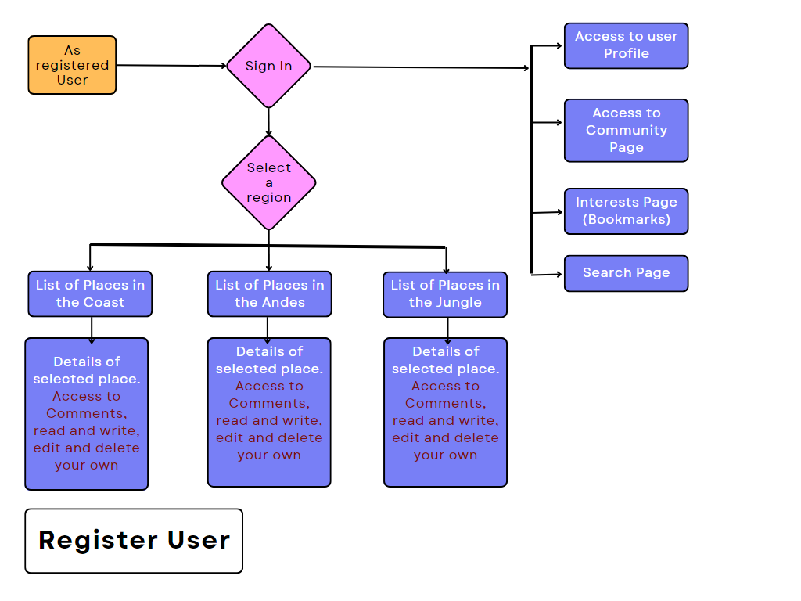
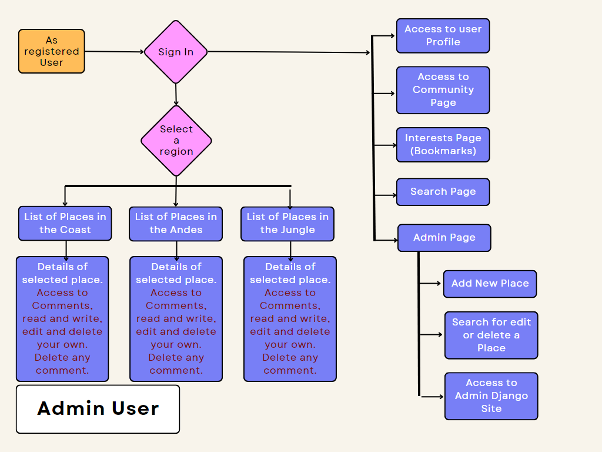

# About

Live Site: [💻 here](https://pp4django-peru-experience.herokuapp.com)
---
 
This site had been created thinking of providing information in a more personal way about Peruvian touristic attractions and experiencing them. At this stage the information that the site displays had been taken from Wikipedia as it is mentioned in the credits. 
It has a search engine by name that allows the users to find a specific place of interest. 
It has different levels of features according to the type of user that accesses the site. For the registed users for example, there is a pin icon that allows them to use the interests option that permits them to bookmark and keep them for future visits. It also opens the option to create a profile and get in touch with the app community. The community functionality is one to be developed in the future.

 

# UX

## Target User
---

The target user is a person that enjoys to know new places and is looking for information about Peru's touristic ones, open to the possibity to belong to a community where could be found travelling partners.

### Unregistered user

It's expected that the user can visualize information about to the touristic places and get them interested to register so that they can interact and in the future, belong to the community.

### Registered user

It's expected that the user can not just visualize information relevant to the touristic places and makes use of interests page, marking down places where they want to get more information about and possibly visit in a future. Also that in the future they join to the community.

### Admin user

It's expected that the admin user can not just access to all the previous features, but that they can post and keep alive the place posting regularily new places, updating them and keeping the control in the interaction of the users and the app. Also managing the community in the future.

## User Stories
---

The Project board has many others that are not listed here as they are referent to set the project and backend creation.  

## User Stories - User Related 
 

### User Story: Registration, Log In and Log Out

As a User I can register so that can log in, in a next time in my account and with this I can have access to all the site features.
  - SignIn Form: User name, password
  - LogIn Form: User name, password
  - SignOut: Redirect to main page

### User Story: View Comments

As a registered User, I want to see  all the comments in the posts when I log in.
   - Render the comments in the HTML for logged users.

### User Story: Create a comment

As a registered User, I want to be able to comment on the places/posts.
   - Form that allows the user to add a comment.

### User Story: Formatting text

   #1 As User I want to be able to format the text in my comments.
      - Add RichTextField to the field for it.

   #2 As Administrator I want to be able to format the text in the post that I created.
      - Add RichTextField to the field for it.

### User Story: Edit Comments

As a register User, I want to be able to edit my comment on the posts.
   - Form that allows the user to edit their comment.

### User Story: Delete comments

As a register User, I want to be able to delete my comments on the posts.
   - Form that allows the user to delete their comment.

### User Story: Admin funtionality in html

As Admin User, I want to be able to create entries about places without having to access to the admin site.
   - Form: Create a post/place
   - Form: Edit Post
   - Form: Delete Post

### User Story: Admin delete comments

As Admin, I want to be able to erase any comment in the blog without having to go in the admin site.
   - Button visible just to the admin for this action

### User Story: Filters by type of location

As a registered User, I want to been able to see the places in the region by type of location
   - Display of filters by type of location in Coast
   - Display of filters by type of location in Andes
   - Display of filters by type of location in Jungle

This User Story had changed in the process to the actual search by name with icontains.

### User Story: Interests list

As a registered User, I want to be able to save a place/posts that are of my interest.
   - Button that allows to save and remove the post from my interests list.

### User Story: User Profile

As a registered User, I want to be able to see my profile where I can see, edit, delete my interests list

This User Story had changed in the process, there is a profile page for the user to enter their details so that they can join the members community if desired.

The Interests list is being rendered in an independent page.

### User Story: Fill a Profile

As a registered User, I want to be able to enter my information so that I can share and interact with the community
   - Form that allows the user to enter the data
   - A Profile page
   - A Community page

### User Story: Like/Unlike

As a registered User, I want to be able to like the post and/or content.

Will not have. Since the begining have doubts about and in the process I found that it would not add value to the blog as I wanted to approach it. And could affect the reference to the place instead to the post itself.

### User Story: Contact Form

As a User, I want to be able to contact the blog author

Won't have. Found that there would not be a need for it. Since in the future with the development of the interaction between profiles and community, there will be direct access to the admin.

## Flowcharts

### Unregistered User

### Registered User

### Admin User

# Features

The list and screenshot about them can be found [here](readme_docs/md_files/features.md).

# Features to Implement in Future

1. In the Peru Experience, the extra search feature. To add option to search by filtering the places/posts.
2. In the Peru Experience, a page with details and maybe an API to the news about Peru.
3. In the Peru Experience, embed map in the details of places page.
3. In the Profile, the functionality for left messages between users. 
4. In the Community, search by location, so that the users can find potential travel partners in their region.

# Bugs

The details to the bugs can be found [here](./readme_docs/md_files/bugs.md)

# Design

The wireframes can be found [here](./readme_docs/md_files/wireframes.md)

The details to the design can be found [here](./readme_docs/md_files/design.md)

# Technologies Used

## Languages

- [HTML](https://html.com/)

- [CSS](https://www.w3.org/Style/CSS/)

- [Python](https://www.python.org/)

- [JavaScript](https://www.javascript.com/)

## Frameworks and Libraries

- [Django](https://www.djangoproject.com/)
Documentation for [here](https://docs.djangoproject.com/en/4.1/intro/)

- [Jquery](https://jquery.com/) 

- [Boostrap](https://getbootstrap.com/)

- [Gunicorn](https://gunicorn.org/)

- [CkEditor](https://ckeditor.com/)

## Database Host

- [ElephantSQL](https://www.elephantsql.com/)  
   Documentation for set a database [here](https://www.elephantsql.com/docs/).

## Deployment Host

- [Heroku](https://id.heroku.com/login)

## Other Resources

- [GitHub](https://github.com/)

- [GitPod](https://www.gitpod.io/)

- [Allauth](https://django-allauth.readthedocs.io/)

- [DjangoCrispyForms](https://django-cryptography.readthedocs.io/)

- [Cloudinary Media](https://cloudinary.com/)

- [iColorpalette](https://icolorpalette.com/)

- [GoogleFonts](https://fonts.google.com/knowledge)

- [FontAwesome](https://fontawesome.com/)

# Validation

The validation reports can be found [here](./readme_docs/md_files/validation.md)

# Testing

The testing results can be found [here](./readme_docs/md_files/testing.md)

# Deployment

The site had been deployed through Heroku.
The site had been developed on GitPod, committed and pushed to GitHub. And Heroku once the site is deployed would update automatically.
The step for this can be found [here](./readme_docs/md_files/deployment.md)

# Credits

For this project I had made use of my own images but 2 taken that I did not count with one that shows the place as deserved.

Kuelap Image:
https://static.independent.co.uk/s3fs-public/thumbnails/image/2018/03/28/15/kuelap-house.jpg?quality=75&width=982&height=726&auto=webp 

Colca Canyon:
https://www.pxfuel.com/

For the actual information of the places I had take it from Wikipedia and Peru Travel, the official turistic site of the Peruvian goverment. I plan to add my own experiences about each and add more places when I have the time for after the end of the course.

About the coding, I have to recognize the help of my mentor Brian Macharia, who always is supportive and helpful. Tutor assistance had been great help as well, as there was so much to learn at once. Online I had found a lot of blogs that I had read and seen videos from where I tried to avoid taking code just as it is but understand the logic and from there work. But as in all, there are exceptions as there is just so many ways to do the things.

Stack Overflow is one of the mains for finding answers to specific questions https://stackoverflow.com

This one from where I got the redirect request.META line

https://stackoverflow.com/questions/35796195/how-to-redirect-to-previous-page-in-django-after-post-request#:~:text=You%20can%20add%20a%20next,the%20value%20of%20this%20path.

From this one I found the link to the Django docs for the second app for Profiles that I implemented

https://docs.djangoproject.com/en/2.0/topics/http/urls/#url-namespaces-and-included-urlconfs

The previous button feature, I saw few options but this one was the one I went for

https://stackoverflow.com/questions/524992/how-to-implement-a-back-link-on-django-templates

For the community page, where just displays the users that updated the profile I am using .exclude

https://chartio.com/resources/tutorials/how-to-filter-for-empty-or-null-values-in-a-django-queryset/

Some other places I review

https://ordinarycoders.com/

https://www.pycodemates.com/2022/03/integrate-ckeditor-to-django-admin-and-form-fields.html

https://www.pythontutorial.net/django-tutorial/

Finally but not less important, as they were of big help the study-group calls where seeing other project I learned and also where I found Daysi McGirr and Matt Boden especialy who helped me to sort the Js function for access within a form.
