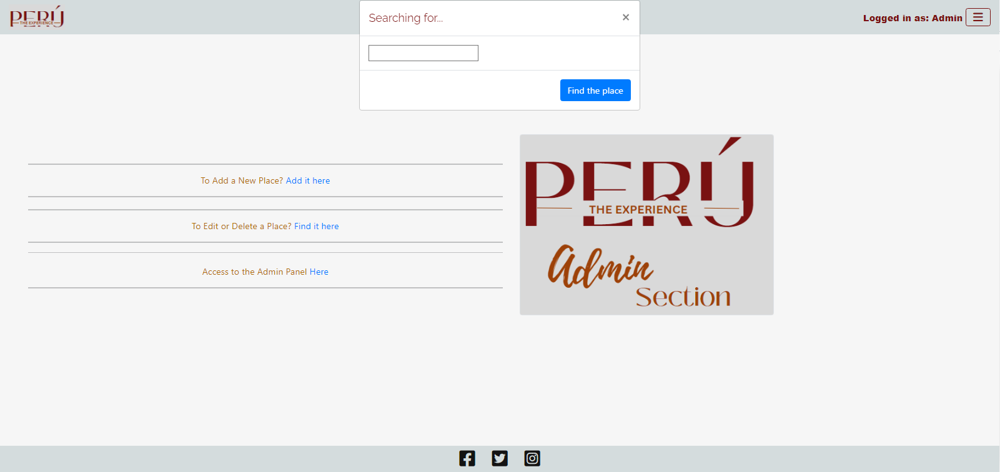

## Navbar

It will remain the same through the site.

### Unregistered User

As unregistered user the navbar will be restricted to display the Log In and Sign Up options.

### Registered User

As registered user the navbar will increase, displaying new options: My Profile, Community, Interests and Search.

### Admin User

As admin user the navbar will expand again, showing access to the admin page.

## Footer

It will remain the same through the site. It will display links to social media, facebook, twitter and instagram.

## Feedback Messages to the users

It will remain the same through the site. They will show for registered users and admin.

Messages and change in pin button 

Message for actions in the site

## Index Page

Landing page will display an image with link to the following section where the user can find 3 animated images, each one gives access to the region they represent.

## Regions Pages

In the three region pages after the navbar can be found a previous button, that it will return the user to the previous page according to the browser history.

Each region page will display it's title with a characteristic background, the background corresponds to textiles of ancient cultures in them.

Next element will be the pagination. Page is paginated to display 4 cards. It can be found before and after the cards display area to give comfort to the user on their preferences.

After that a card will be displayed for each place/post that belongs to the region the user is visiting. Each card will display the pin icon to inform to the registered users if it is in their list of interests already or not. An image of the place, it's name and an icon with the count of comments if they exist for that place.

## Details Page

In this page can be found the details of the selected place. It follows the same design of cards. The card contains an image of the place, the pin (bookmark) button, name and information about it. Also will contain a small icon with the count of the comments that were left for that place. A section with buttons, different ones will display according to the type of user. Finally It will be a section where the comments will be displayed if the user is logged in, and the functionality for the comments that will be explained in each type of user.

Button section details:

### Unregistered User

It will contain a message inviting the user to Sign Up. The message presents a direct link for it.

### Registered User

For this user, extra features will be opened. It will display a button for to leave comments. Also will have all the comments displayed. For the comments that belong to the user that is logged in, there will be displayed buttons that allow them to edit or delete them.

### Admin User

Finally for this type of user, the features will be extended. Over the previous features, it will display buttons that allow to edit or delete the place/post itself. Also will not just allow to interact with comments that belong to the admin user but to delete any comment directly from the front end.

## Search Page

This page had been created for to give access to the user to find a specific place of their interest. It had suffered some changes in the proccess as there was some conflict with a type of search by location that was included and the validator would not accept it. So I decided to drop it, and keep in the research so that in the future can be reinstalled.

First Page

Actual Page

Search Page displaying results to it

## Interests Page

In this page will be displayed all the places/posts that the logged in user had pinned.

## Profile Page

In this page the user can update their profile, the one is created automatically once they register. The profile will remain in default and will not be included in the community page until the user decides to enter their information with the form. The form can be accessed by the link in the message where the user is invited to update their profile.

Profile by default.

Profile Form.

Profile Updated.

## Community Page

In this page will be displayed all the registered users that had updated their profile.

## Admin Page

This page is displayed just for admin users. It has access to the form for adding new places, search to find a place so edit or delete it. Also has a direct link to the Django Admin Site. Note that this page will lose format once the debug is set to False.

